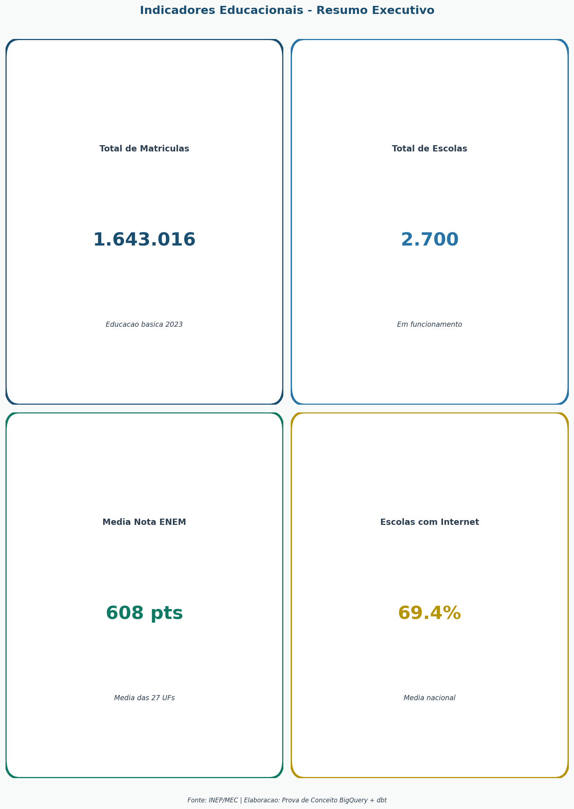
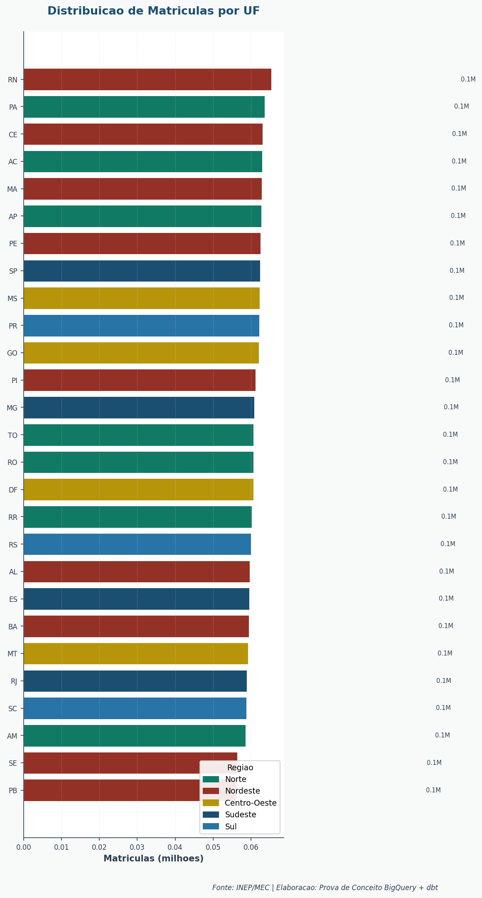
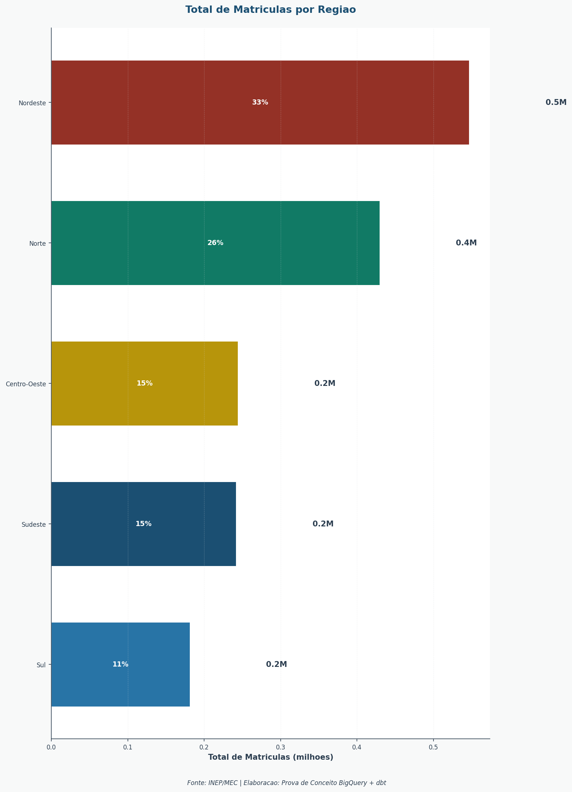
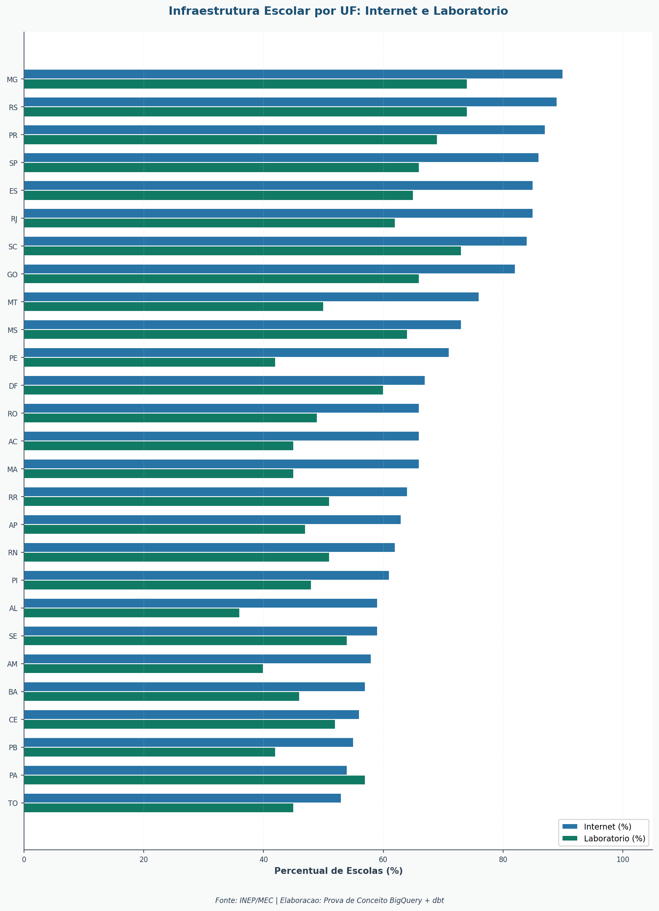
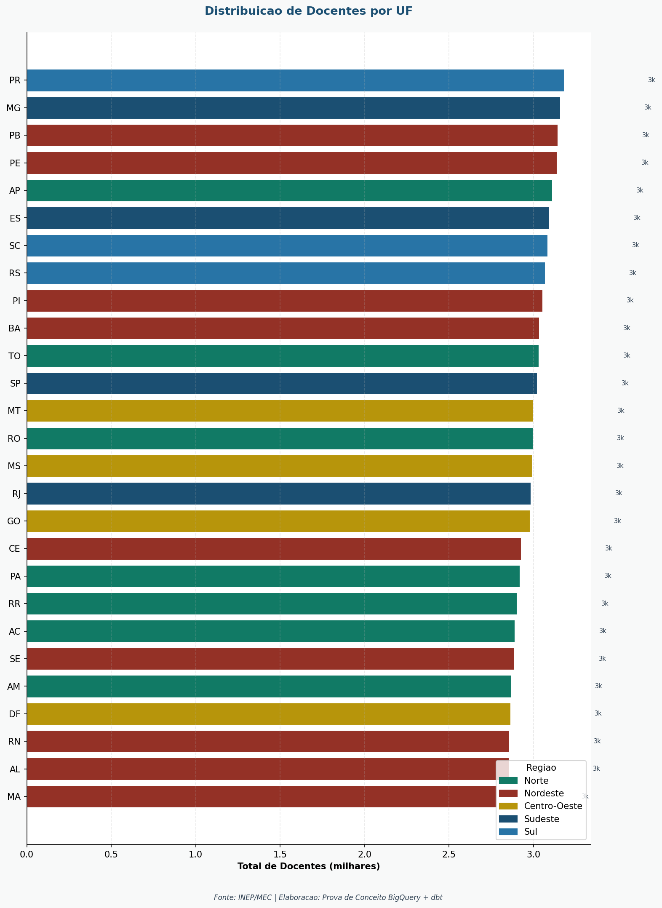
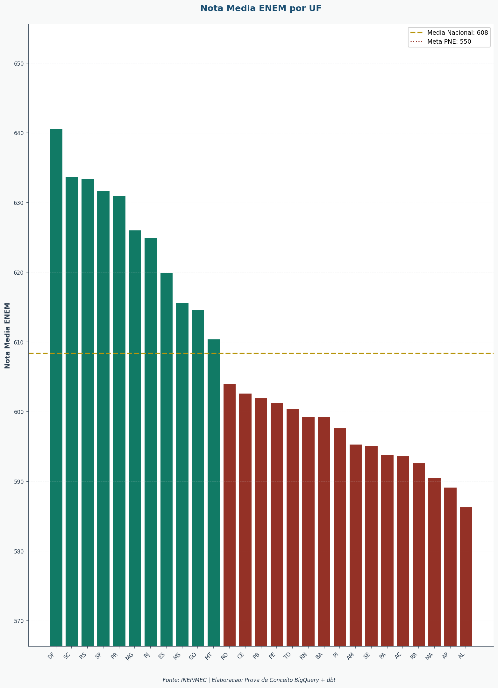
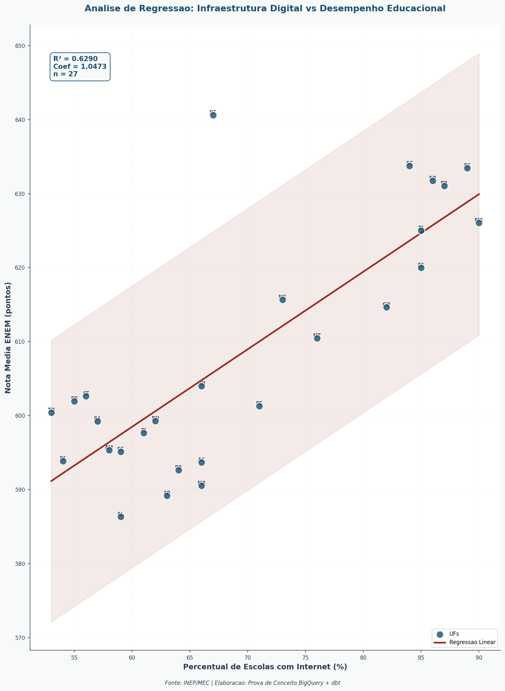
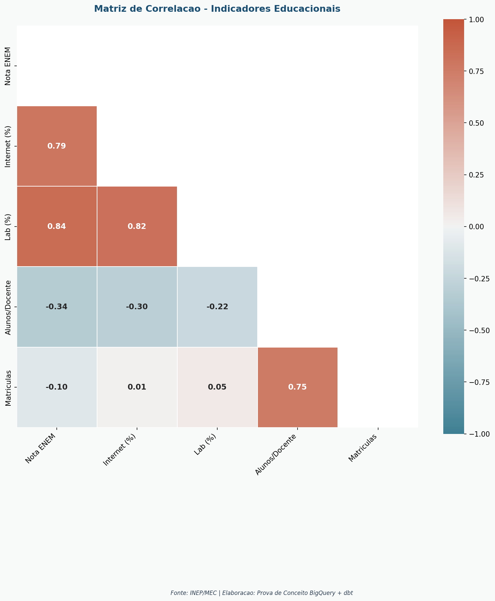
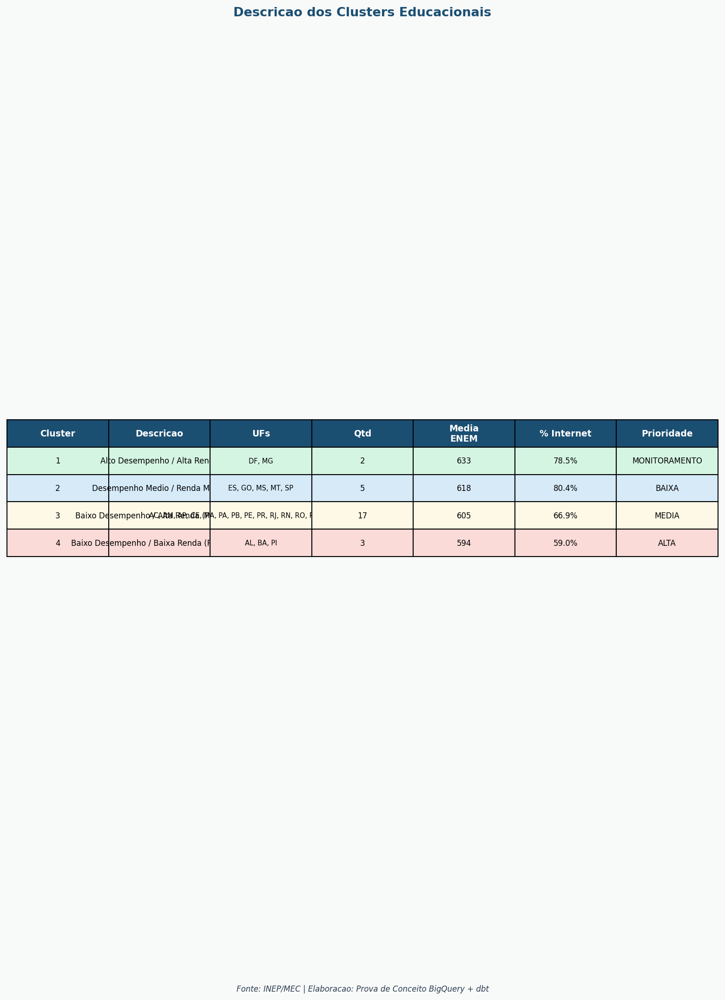

# Guia: Dashboard Educação MEC no Looker Studio

> Guia completo de configuração do dashboard educacional MEC/INEP no Looker Studio.
> Todos os títulos e fontes de dados estão em blocos de código — basta clicar e copiar.

---

## Pré-requisitos

- Conta Google com acesso ao projeto BigQuery `provas-de-conceitos`
- Permissão mínima: `BigQuery Data Viewer` no dataset `mec_educacao_dev`
- dbt executado com sucesso (tabelas `mart_*` disponíveis)

---

## 1. Criar o Relatório

1. Acesse [lookerstudio.google.com](https://lookerstudio.google.com)
2. Clique em **Criar** > **Relatório**
3. Em "Adicionar dados ao relatório", selecione **BigQuery**
4. Autorize o acesso à sua conta Google
5. Selecione: **Projeto** `provas-de-conceitos` > **Dataset** `mec_educacao_dev`
6. Selecione a tabela principal:

```
provas-de-conceitos.mec_educacao_dev.mart_educacao_uf
```

7. Clique em **Adicionar** > **Adicionar ao relatório**

---

## 2. Tabelas Disponíveis

| Tabela | Uso no dashboard |
|--------|------------------|
| `mart_educacao_uf` | Base de todos os gráficos descritivos por UF |
| `mart_educacao_municipio` | Filtros por município |
| `mart_analises_municipio` | Textos narrativos e filtro de cidade |
| `mart_clusters` | Clusterização e scatter de perfis |
| `mart_correlacoes` | Heatmap de correlação de Pearson |
| `mart_alocacao` | Priorização e gaps de infraestrutura |
| `mart_simulacao_cenarios` | Simulação de cenários de investimento |

---

## 3. Campo Calculado: REGIAO

Crie este campo em **todas** as fontes de dados que contenham a coluna `UF`.

**Como criar:** clique na fonte de dados > **Adicionar campo** > **Campo calculado** > cole o código abaixo > salve com o nome `REGIAO`.

```sql
CASE
    WHEN UF IN ('AC','AP','AM','PA','RO','RR','TO') THEN 'Norte'
    WHEN UF IN ('AL','BA','CE','MA','PB','PE','PI','RN','SE') THEN 'Nordeste'
    WHEN UF IN ('DF','GO','MT','MS') THEN 'Centro-Oeste'
    WHEN UF IN ('ES','MG','RJ','SP') THEN 'Sudeste'
    WHEN UF IN ('PR','RS','SC') THEN 'Sul'
END
```

---

## 4. Tema, Cores e Tipografia

### Aplicar tema

Menu **Tema** > **Personalizar tema**

### Paleta de cores

```
#1B4F72   Azul Escuro    — títulos, destaque principal
#2874A6   Azul Médio     — barras, pontos de dispersão
#5DADE2   Azul Claro     — escala mínima em mapas
#117A65   Verde          — métricas positivas, laboratório
#B7950B   Âmbar          — atenção, cluster potencial
#943126   Vermelho       — crítico, gap, escala máxima
#F8F9F9   Cinza Claro    — fundo dos painéis
#2C3E50   Cinza Escuro   — texto corrido
```

### Tipografia

| Elemento | Fonte | Tamanho | Estilo |
|----------|-------|---------|--------|
| Título do relatório | Google Sans | 22 pt | Negrito |
| Título de gráfico | Google Sans | 14 pt | Negrito |
| Rótulos de eixo | Roboto | 11 pt | Regular |
| Valores em scorecard | Roboto | 28 pt | Negrito |
| Texto de legenda | Roboto | 10 pt | Regular |

---

## 5. Dimensões e Filtros Globais

### Tamanho do relatório

Menu **Arquivo** > **Configurações do relatório** > **Tamanho personalizado**

```
Largura:  1588 px
Altura:   2246 px
```

Orientação: Retrato — ideal para exportação em PDF.

### Filtros (aplicar em todas as 4 páginas)

| Filtro | Tipo | Fonte | Campo |
|--------|------|-------|-------|
| Ano | Lista suspensa, seleção única | `mart_educacao_uf` | `ANO` |
| UF | Lista suspensa, seleção múltipla, pesquisa habilitada | `mart_educacao_uf` | `UF` |
| Município | Lista suspensa | `mart_analises_municipio` | `CIDADE` |
| Região | Caixa de seleção | `mart_educacao_uf` | `REGIAO` (campo calculado) |

---

## 6. Página 1 — Resumo Executivo

**Título da página:**
```
Painel de Indicadores Educacionais - MEC/INEP
```

**Subtítulo sugerido:**
```
Dados: Censo Escolar e ENEM 2023 — INEP/MEC
```

---

### 6.1 Scorecards — 4 KPIs

**Fonte:**
```
Censo Escolar da Educação Básica 2023 — INEP/MEC
Microdados do ENEM 2023 — INEP/MEC
```

**Tabela BigQuery:**
```
provas-de-conceitos.mec_educacao_dev.mart_educacao_uf
```

Crie 4 scorecards individuais com os campos abaixo:

| Scorecard | Campo BigQuery | Título do scorecard |
|-----------|----------------|---------------------|
| Matrículas | `SUM(TOTAL_MATRICULAS)` | `Total de Matrículas` |
| Escolas | `SUM(TOTAL_ESCOLAS)` | `Total de Escolas` |
| ENEM | `AVG(NOTA_MEDIA_ENEM)` | `Média ENEM (0–1000)` |
| Internet | `AVG(PCT_ESCOLAS_INTERNET)` | `% Escolas Conectadas` |

**Estilo dos scorecards:**
- Cor do valor: `#1B4F72`
- Cor do rótulo: `#2C3E50`
- Casas decimais: 0 para contagens, 1 para percentuais e notas



---

### 6.2 Mapa Geográfico — Matrículas por UF

**Fonte:**
```
Censo Escolar da Educação Básica 2023 — INEP/MEC
```

**Tabela BigQuery:**
```
provas-de-conceitos.mec_educacao_dev.mart_educacao_uf
```

**Título:**
```
Distribuição de Matrículas por Estado — 2023
```

| Configuração | Valor |
|-------------|-------|
| Tipo | Mapa geográfico |
| Dimensão | `UF` |
| Rótulo da dimensão | `Estado (UF)` |
| Métrica | `SUM(TOTAL_MATRICULAS)` |
| Rótulo da métrica | `Total de Matrículas` |
| Cor mínima (escala) | `#5DADE2` |
| Cor máxima (escala) | `#1B4F72` |
| Região do mapa | Brasil |



---

### 6.3 Tabela Resumo — Top UFs por ENEM

**Fonte:**
```
Microdados do ENEM 2023 — INEP/MEC
```

**Tabela BigQuery:**
```
provas-de-conceitos.mec_educacao_dev.mart_educacao_uf
```

**Título:**
```
Ranking de Estados por Desempenho no ENEM — 2023
```

| Configuração | Valor |
|-------------|-------|
| Tipo | Tabela |
| Dimensão | `UF` — rótulo: `Estado (UF)` |
| Métrica principal | `AVG(NOTA_MEDIA_ENEM)` — rótulo: `Desempenho Médio ENEM` |
| Ordenação | `NOTA_MEDIA_ENEM` decrescente |
| Linhas por página | 27 (todas as UFs) |
| Rodapé | `Dados: INEP/MEC — Censo Escolar e ENEM 2023` |

---

## 7. Página 2 — Análise Descritiva

**Título da página:**
```
Análise Descritiva por Unidade Federativa
```

---

### 7.1 Matrículas por Região

**Fonte:**
```
Censo Escolar da Educação Básica 2023 — INEP/MEC
```

**Tabela BigQuery:**
```
provas-de-conceitos.mec_educacao_dev.mart_educacao_uf
```

**Título:**
```
Matrículas por Região — Brasil 2023
```

| Configuração | Valor |
|-------------|-------|
| Tipo | Gráfico de barras (horizontal) |
| Dimensão | `REGIAO` (campo calculado) |
| Rótulo da dimensão | `Região` |
| Métrica | `SUM(TOTAL_MATRICULAS)` |
| Rótulo da métrica | `Total de Matrículas` |
| Ordenação | Decrescente por métrica |
| Cores | Uma cor por região (veja tabela abaixo) |

**Cores por região:**

| Região | Cor (hex) |
|--------|-----------|
| Norte | `#943126` |
| Nordeste | `#B7950B` |
| Centro-Oeste | `#117A65` |
| Sudeste | `#1B4F72` |
| Sul | `#5DADE2` |



---

### 7.2 Infraestrutura Digital e Científica por UF

**Fonte:**
```
Censo Escolar da Educação Básica 2023 — INEP/MEC
```

**Tabela BigQuery:**
```
provas-de-conceitos.mec_educacao_dev.mart_educacao_uf
```

**Título:**
```
Infraestrutura Digital e Científica por Estado — 2023
```

| Configuração | Valor |
|-------------|-------|
| Tipo | Gráfico de barras agrupadas |
| Dimensão | `UF` |
| Rótulo da dimensão | `Estado (UF)` |
| Ordenação | `AVG(PCT_ESCOLAS_INTERNET)` decrescente |

**Métricas:**

| Campo BigQuery | Rótulo exibido | Cor |
|----------------|----------------|-----|
| `AVG(PCT_ESCOLAS_INTERNET)` | `% Escolas com Internet` | `#2874A6` |
| `AVG(PCT_ESCOLAS_LABORATORIO)` | `% Escolas com Laboratório` | `#117A65` |



---

### 7.3 Distribuição do Corpo Docente por Estado

**Fonte:**
```
Censo Escolar da Educação Básica 2023 — INEP/MEC
```

**Tabela BigQuery:**
```
provas-de-conceitos.mec_educacao_dev.mart_educacao_uf
```

**Título:**
```
Distribuição do Corpo Docente por Estado — 2023
```

| Configuração | Valor |
|-------------|-------|
| Tipo | Gráfico de barras (horizontal) |
| Dimensão | `UF` |
| Rótulo da dimensão | `Estado (UF)` |
| Métrica | `SUM(TOTAL_DOCENTES)` |
| Rótulo da métrica | `Total de Docentes` |
| Dimensão de cor | `REGIAO` (campo calculado) |
| Ordenação | Decrescente por métrica |

**Cores por região** (as mesmas do gráfico 7.1 acima)



---

### 7.4 Desempenho no ENEM por Estado

**Fonte:**
```
Microdados do ENEM 2023 — INEP/MEC
```

**Tabela BigQuery:**
```
provas-de-conceitos.mec_educacao_dev.mart_educacao_uf
```

**Título:**
```
Desempenho no ENEM por Estado — 2023
```

| Configuração | Valor |
|-------------|-------|
| Tipo | Gráfico de barras (vertical) |
| Dimensão | `UF` |
| Rótulo da dimensão | `Estado (UF)` |
| Métrica | `AVG(NOTA_MEDIA_ENEM)` |
| Rótulo da métrica | `Desempenho Médio ENEM (0–1000)` |
| Cor das barras | `#2874A6` |
| Ordenação | Decrescente por métrica |

**Linhas de referência:**

| Linha | Tipo | Valor | Cor | Rótulo |
|-------|------|-------|-----|--------|
| Média nacional | Constante calculada | `AVG(NOTA_MEDIA_ENEM)` de todo o Brasil | `#2C3E50` | `Média BR` |
| Meta PNE | Constante fixa | `550` | `#943126` | `Meta PNE` |



---

## 8. Página 3 — Análise Preditiva

**Título da página:**
```
Análise Preditiva — Clusters e Correlações
```

---

### 8.1 Agrupamento de Estados por Perfil (Scatter)

**Fonte:**
```
Censo Escolar da Educação Básica 2023 — INEP/MEC
Microdados do ENEM 2023 — INEP/MEC
```

**Tabela BigQuery:**
```
provas-de-conceitos.mec_educacao_dev.mart_clusters
```

**Título:**
```
Agrupamento de Estados por Perfil Educacional — 2023
```

| Configuração | Valor |
|-------------|-------|
| Tipo | Dispersão (Scatter) |
| Eixo X | `Z_SCORE_NOTA` |
| Rótulo eixo X | `Componente Principal 1 (Desempenho)` |
| Eixo Y | `Z_SCORE_RENDA` |
| Rótulo eixo Y | `Componente Principal 2 (Infraestrutura)` |
| Dimensão de cor | `CLUSTER_ID` — rótulo: `Cluster` |
| Rótulos dos pontos | `UF` |
| Tamanho dos pontos | Fixo (sem métrica de tamanho) |

**Cores por cluster:**

| Cluster | Perfil | Cor |
|---------|--------|-----|
| 1 | Alto Desempenho | `#1B4F72` |
| 2 | Médio | `#2874A6` |
| 3 | Potencial | `#B7950B` |
| 4 | Prioritário | `#943126` |


---

### 8.2 Conectividade vs. Desempenho (Scatter com tendência)

**Fonte:**
```
Censo Escolar da Educação Básica 2023 — INEP/MEC
Microdados do ENEM 2023 — INEP/MEC
```

**Tabela BigQuery:**
```
provas-de-conceitos.mec_educacao_dev.mart_educacao_uf
```

**Título:**
```
Conectividade Escolar vs. Desempenho no ENEM — 2023
```

| Configuração | Valor |
|-------------|-------|
| Tipo | Dispersão com linha de tendência |
| Eixo X | `PCT_ESCOLAS_INTERNET` |
| Rótulo eixo X | `% Escolas Conectadas à Internet` |
| Eixo Y | `NOTA_MEDIA_ENEM` |
| Rótulo eixo Y | `Desempenho Médio ENEM (0–1000)` |
| Rótulos dos pontos | `UF` |
| Cor dos pontos | `#2874A6` |
| Linha de tendência | Regressão linear — habilitar em **Estilo** > **Série** > **Linha de tendência** |
| Cor da linha de tendência | `#943126` |



---

### 8.3 Matriz de Correlação (Heatmap)

**Fonte:**
```
Censo Escolar da Educação Básica 2023 — INEP/MEC
Microdados do ENEM 2023 — INEP/MEC
```

**Tabela BigQuery:**
```
provas-de-conceitos.mec_educacao_dev.mart_correlacoes
```

**Título:**
```
Matriz de Correlação entre Indicadores Educacionais
```

| Configuração | Valor |
|-------------|-------|
| Tipo | Tabela com formatação condicional |
| Dimensão | `PAR_VARIAVEIS` — rótulo: `Par de Variáveis` |
| Métrica | `CORRELACAO` — rótulo: `Correlação de Pearson` |

**Escala de cor condicional (no campo `CORRELACAO`):**

| Valor | Cor | Significado |
|-------|-----|-------------|
| `-1.0` | `#943126` | Correlação negativa forte |
| `0.0` | `#F8F9F9` | Sem correlação |
| `+1.0` | `#1B4F72` | Correlação positiva forte |



---

### 8.4 Mapa de Bolhas — Agrupamento por UF

**Fonte:**
```
Censo Escolar da Educação Básica 2023 — INEP/MEC
Microdados do ENEM 2023 — INEP/MEC
```

**Tabela BigQuery:**
```
provas-de-conceitos.mec_educacao_dev_marts.mart_clusters
```

**Título:**
```
Mapa de Bolhas — Agrupamento de Estados por Perfil Educacional
```

| Configuração | Valor |
|-------------|-------|
| Tipo | Google Maps |
| Dimensão de localização — Latitude | `LATITUDE_UF` |
| Dimensão de localização — Longitude | `LONGITUDE_UF` |
| Métrica de tamanho | `INVESTIMENTO_TOTAL_ESTIMADO_BRL` — rótulo: `Investimento Estimado (R$)` |
| Dimensão de cor | `CLUSTER_ID` — rótulo: `Cluster` |
| Rótulos dos pontos | `UF` |

**Campos disponíveis para tooltip (adicionar como dimensões secundárias):**

| Campo BigQuery | Rótulo sugerido |
|----------------|-----------------|
| `STATUS_DESEMPENHO` | `Status de Desempenho` |
| `GAP_INTERNET_PCT` | `Gap Internet (p.p.)` |
| `GAP_LABORATORIO_PCT` | `Gap Laboratório (p.p.)` |
| `DESCRICAO_CLUSTER` | `Perfil do Cluster` |

**Cores por cluster** (as mesmas do scatter 8.1):

| Cluster | Perfil | Cor |
|---------|--------|-----|
| 1 | Alto Desempenho | `#1B4F72` |
| 2 | Médio | `#2874A6` |
| 3 | Potencial | `#B7950B` |
| 4 | Prioritário | `#943126` |

> Como configurar: no painel de dados do gráfico Google Maps, selecione **Localização** > **Campo de latitude/longitude**. Mapeie `LATITUDE_UF` para Latitude e `LONGITUDE_UF` para Longitude. O Looker Studio posicionará cada bolha no centroide da UF.

---

### 8.5 Perfis de Clusters — Tabela Descritiva

**Fonte:**
```
Censo Escolar da Educação Básica 2023 — INEP/MEC
Microdados do ENEM 2023 — INEP/MEC
```

**Tabela BigQuery:**
```
provas-de-conceitos.mec_educacao_dev.mart_clusters
```

**Título:**
```
Perfis de Clusters Educacionais — Resumo por Grupo
```

| Campo BigQuery | Rótulo exibido |
|----------------|----------------|
| `CLUSTER_ID` | `Cluster` |
| `DESCRICAO_CLUSTER` | `Perfil do Grupo` |
| `COUNT(UF)` | `Nº de Estados` |
| `AVG(NOTA_MEDIA_ENEM)` | `Média ENEM (0–1000)` |
| `PRIORIDADE_INVESTIMENTO` | `Prioridade` |

**Formatação condicional no campo `PRIORIDADE_INVESTIMENTO`:**

| Valor | Cor |
|-------|-----|
| `ALTA` | `#943126` |
| `MEDIA` | `#B7950B` |
| `BAIXA` | `#117A65` |
| `MONITORAMENTO` | `#2874A6` |



---

## 9. Página 4 — Análise Prescritiva

**Título da página:**
```
Análise Prescritiva — Priorização de Investimentos
```

---

### 9.1 Investimento Necessário por Estado

**Fonte:**
```
Censo Escolar da Educação Básica 2023 — INEP/MEC
Microdados do ENEM 2023 — INEP/MEC
```

**Tabela BigQuery:**
```
provas-de-conceitos.mec_educacao_dev.mart_alocacao
```

**Título:**
```
Investimento Necessário por Estado — Estimativa 2023
```

| Configuração | Valor |
|-------------|-------|
| Tipo | Gráfico de barras (horizontal) |
| Dimensão | `UF` — rótulo: `Estado (UF)` |
| Métrica | `INVESTIMENTO_TOTAL_ESTIMADO_BRL` |
| Rótulo da métrica | `Investimento Estimado (R$)` |
| Dimensão de cor | `STATUS_DESEMPENHO` — rótulo: `Status de Desempenho` |
| Ordenação | `ORDEM_PRIORIDADE` crescente |

**Cores por status:**

| Valor no campo | Cor | Significado |
|----------------|-----|-------------|
| `CRITICO` | `#943126` | Intervenção urgente |
| `ATENCAO` | `#B7950B` | Monitoramento intensivo |
| `REGULAR` | `#5DADE2` | Manutenção |
| `ADEQUADO` | `#117A65` | Referência |


---

### 9.2 Retorno do Investimento por Cenário — Nota Projetada vs. Nota Atual

> **Narrativa:** A pergunta central desta seção é "quanto a educação melhora por real investido?"
> O modelo projeta que cada ponto percentual de aumento orçamentário equivale a +0,4 ponto
> na nota média do ENEM nacional. O trade-off não é entre cenários que funcionam e cenários
> que não funcionam — todos funcionam linearmente. O trade-off é entre **impacto e risco fiscal**.
> O cenário Moderado (15-20%) representa o ponto de equilíbrio: ganho educacional expressivo
> com viabilidade orçamentária.

**Fonte:**
```
Microdados do ENEM 2023 — INEP/MEC
```

**Tabela BigQuery:**
```
provas-de-conceitos.mec_educacao_dev.mart_simulacao_cenarios
```

---

#### 9.2a — Ganho Projetado no ENEM por Cenário (gráfico principal)

**Título:**
```
Quanto o ENEM melhora a cada nível de investimento?
```

| Configuração | Valor |
|-------------|-------|
| Tipo | Gráfico de barras (vertical) |
| Dimensão (eixo X) | `CENARIO_NOME` — rótulo: `Aumento Orçamentário` |
| Ordenação | `AUMENTO_PERCENTUAL` **crescente** (5% → 30%) |
| Métrica | `IMPACTO_NOTA_ENEM_PONTOS` — rótulo: `Ganho no ENEM (pontos)` |
| Dimensão de cor | `TIPO_CENARIO` — rótulo: `Perfil de Risco` |
| Formato da métrica | **Número** com 1 decimal — **NÃO usar formato percentual** |

> Cores por perfil de risco:

| Valor | Cor | Significado |
|-------|-----|-------------|
| `Conservador` | `#5DADE2` | Baixo risco fiscal — ganho de 2 a 4 pts |
| `Moderado` | `#2874A6` | Risco administrável — ganho de 6 a 8 pts |
| `Agressivo` | `#943126` | Alto risco fiscal — ganho de 10 a 12 pts |

> **Atenção:** NÃO adicionar `TIPO_CENARIO` no campo "Dimensão detalhada". Usá-lo apenas
> como cor. Isso garante uma barra por cenário, colorida pelo perfil de risco.

---

#### 9.2b — Nota Atual vs. Nota Projetada por Cenário (scorecard comparativo)

**Título:**
```
De onde partimos e onde podemos chegar
```

Crie uma **tabela simples** com os campos abaixo, sem agregação:

| Campo BigQuery | Rótulo exibido | Formato |
|----------------|----------------|---------|
| `CENARIO_NOME` | `Cenário` | Texto |
| `TIPO_CENARIO` | `Perfil de Risco` | Texto |
| `NOTA_BASE` | `Nota Atual (média nacional)` | Número — 1 decimal |
| `IMPACTO_NOTA_ENEM_PONTOS` | `Ganho Projetado (pts)` | Número — 1 decimal |
| `NOTA_PROJETADA` | `Nota Projetada` | Número — 1 decimal |
| `AVALIACAO_RISCO` | `Avaliação de Risco` | Texto |

> Esta tabela ancora a simulação num número concreto: o leitor vê que a nota média
> atual é ~551 e que um investimento moderado de 20% projetaria ~559 — cruzando a
> meta de 550 pts do PNE para os estados que ainda estão abaixo.

---

#### 9.2c — Quantos alunos a mais permanecem na escola?

**Título:**
```
Redução Projetada na Evasão Escolar por Cenário de Investimento
```

**Subtítulo do gráfico (caixa de texto acima):**
```
Como ler: o eixo X mostra o quanto o orçamento aumenta (5% a 30%).
O eixo Y mostra quantos pontos percentuais a taxa de abandono escolar diminui.
Exemplo: com +20% de orçamento, a evasão cai 1,6 p.p. — se hoje 10% dos alunos
abandonam a escola, esse número cairia para 8,4%.
```

| Configuração | Valor |
|-------------|-------|
| Tipo | Gráfico de barras (vertical) |
| Dimensão (eixo X) | `CENARIO_NOME` — rótulo: `Aumento no Orçamento de Educação` |
| Ordenação | `AUMENTO_PERCENTUAL` **crescente** (5% → 30%) |
| Métrica | `REDUCAO_ABANDONO_PCT` — rótulo: `Redução na Evasão (pontos percentuais)` |
| Dimensão de cor | `TIPO_CENARIO` — rótulo: `Perfil de Risco` |
| Formato da métrica | **Número** com 1 decimal — **não usar formato `%`** |

> **Por que não usar `%` no eixo Y:**
> O eixo X já exibe percentuais de aumento orçamentário (5%, 10%...).
> O eixo Y mede **pontos percentuais de evasão** — uma unidade diferente.
> Formatar o Y como `%` cria a leitura errada de "2% de algo", quando o correto é
> "2 pontos percentuais a menos na taxa de abandono".
> Use o rótulo **`p.p.`** para deixar a distinção visível no gráfico.

> **Cores:** as mesmas do gráfico 9.2a — Conservador `#5DADE2`, Moderado `#2874A6`, Agressivo `#943126`.


---

### 9.3 Mapa de Necessidade de Investimento

**Fonte:**
```
Censo Escolar da Educação Básica 2023 — INEP/MEC
Microdados do ENEM 2023 — INEP/MEC
```

**Tabela BigQuery:**
```
provas-de-conceitos.mec_educacao_dev.mart_alocacao
```

**Título:**
```
Mapa de Necessidade de Investimento por Estado — 2023
```

| Configuração | Valor |
|-------------|-------|
| Tipo | Mapa geográfico |
| Dimensão | `UF` — rótulo: `Estado (UF)` |
| Métrica | `INVESTIMENTO_TOTAL_ESTIMADO_BRL` |
| Rótulo da métrica | `Investimento Estimado (R$)` |
| Cor mínima (escala) | `#5DADE2` |
| Cor máxima (escala) | `#943126` |
| Região do mapa | Brasil |


---

### 9.4 Ranking de Prioridade de Investimento

**Fonte:**
```
Censo Escolar da Educação Básica 2023 — INEP/MEC
Microdados do ENEM 2023 — INEP/MEC
```

**Tabela BigQuery:**
```
provas-de-conceitos.mec_educacao_dev.mart_alocacao
```

**Tabela adicional (JOIN):**
```
provas-de-conceitos.mec_educacao_dev.mart_clusters
```

**Título:**
```
Ranking de Prioridade de Investimento por Estado — 2023
```

| Campo BigQuery | Rótulo exibido |
|----------------|----------------|
| `UF` | `Estado` |
| `STATUS_DESEMPENHO` | `Status` |
| `GAP_INTERNET_PCT` | `Gap Internet (p.p.)` |
| `GAP_LABORATORIO_PCT` | `Gap Laboratório (p.p.)` |
| `INVESTIMENTO_TOTAL_ESTIMADO_BRL` | `Investimento Estimado (R$)` |
| `DESCRICAO_CLUSTER` | `Perfil do Cluster` |

- Ordenação: `ORDEM_PRIORIDADE` crescente
- Formatação condicional em `STATUS_DESEMPENHO` — mesmas cores do gráfico 9.1


---

### 9.5 Déficit de Infraestrutura por Estado

**Fonte:**
```
Censo Escolar da Educação Básica 2023 — INEP/MEC
```

**Tabela BigQuery:**
```
provas-de-conceitos.mec_educacao_dev.mart_alocacao
```

**Título:**
```
Déficit de Infraestrutura por Estado — 2023
```

| Configuração | Valor |
|-------------|-------|
| Tipo | Gráfico de barras agrupadas (horizontal) |
| Dimensão | `UF` — rótulo: `Estado (UF)` |
| Ordenação | `ORDEM_PRIORIDADE` crescente |

**Métricas:**

| Campo BigQuery | Rótulo exibido | Cor |
|----------------|----------------|-----|
| `GAP_INTERNET_PCT` | `Gap Internet (pontos percentuais)` | `#943126` |
| `GAP_LABORATORIO_PCT` | `Gap Laboratório (pontos percentuais)` | `#B7950B` |


---

## 10. Checklist Final

### Estrutura
- [ ] 4 páginas criadas com os títulos exatos desta seção
- [ ] Subtítulo com ano de referência em cada página
- [ ] Filtros globais (Ano, UF, Município, Região) aplicados em todas as páginas

### Dados
- [ ] Conexão BigQuery funcionando para todas as 7 tabelas
- [ ] Campo calculado `REGIAO` criado em todas as fontes que usam `UF`
- [ ] Nenhuma tabela retornando erro de permissão

### Gráficos
- [ ] Títulos copiados exatamente como indicado em cada seção
- [ ] Rótulos de eixos e métricas em português legível
- [ ] Cores corporativas aplicadas por série/dimensão conforme tabelas acima
- [ ] Linha de tendência habilitada no gráfico de dispersão (8.2)
- [ ] Linhas de referência (média BR e meta PNE) no gráfico 7.4
- [ ] Formatação condicional configurada nas tabelas de cluster e priorização

### Tema
- [ ] Paleta de cores aplicada no tema global
- [ ] Tipografia configurada (Google Sans para títulos, Roboto para rótulos)
- [ ] Dimensões do relatório: 1588 × 2246 px

### Exportação
- [ ] Teste de exportação PDF realizado (Menu **Arquivo** > **Fazer download** > **PDF**)
- [ ] Rodapé com fonte de dados citada em cada página

---

## 11. Queries de Verificação

Use estas queries no BigQuery para validar os dados antes de montar o dashboard.

### Verificar todas as UFs presentes

```sql
SELECT ANO, COUNT(DISTINCT UF) AS total_ufs
FROM `provas-de-conceitos.mec_educacao_dev.mart_educacao_uf`
GROUP BY ANO
ORDER BY ANO DESC
```

### Top 10 UFs por Nota ENEM

```sql
SELECT UF, ROUND(NOTA_MEDIA_ENEM, 1) AS nota
FROM `provas-de-conceitos.mec_educacao_dev.mart_educacao_uf`
WHERE ANO = 2023
ORDER BY NOTA_MEDIA_ENEM DESC
LIMIT 10
```

### Estados abaixo da meta PNE (550 pontos)

```sql
SELECT UF, ROUND(NOTA_MEDIA_ENEM, 1) AS nota, ROUND(550 - NOTA_MEDIA_ENEM, 1) AS gap_meta
FROM `provas-de-conceitos.mec_educacao_dev.mart_educacao_uf`
WHERE ANO = 2023
  AND NOTA_MEDIA_ENEM < 550
ORDER BY NOTA_MEDIA_ENEM ASC
```

### Municípios com prioridade ALTA

```sql
SELECT CIDADE, UF, PRIORIDADE_INVESTIMENTO, ROUND(NOTA_MEDIA_ENEM, 1) AS nota
FROM `provas-de-conceitos.mec_educacao_dev.mart_analises_municipio`
WHERE PRIORIDADE_INVESTIMENTO = 'ALTA'
ORDER BY NOTA_MEDIA_ENEM ASC
LIMIT 50
```

### Comparativo regional completo

```sql
SELECT
    CASE
        WHEN UF IN ('AC','AP','AM','PA','RO','RR','TO') THEN 'Norte'
        WHEN UF IN ('AL','BA','CE','MA','PB','PE','PI','RN','SE') THEN 'Nordeste'
        WHEN UF IN ('DF','GO','MT','MS') THEN 'Centro-Oeste'
        WHEN UF IN ('ES','MG','RJ','SP') THEN 'Sudeste'
        WHEN UF IN ('PR','RS','SC') THEN 'Sul'
    END AS REGIAO,
    COUNT(DISTINCT UF) AS total_ufs,
    SUM(TOTAL_MATRICULAS) AS matriculas,
    ROUND(AVG(NOTA_MEDIA_ENEM), 1) AS media_enem,
    ROUND(AVG(PCT_ESCOLAS_INTERNET), 1) AS pct_internet
FROM `provas-de-conceitos.mec_educacao_dev.mart_educacao_uf`
WHERE ANO = 2023
GROUP BY REGIAO
ORDER BY media_enem DESC
```

### Validar clusters gerados

```sql
SELECT CLUSTER_ID, DESCRICAO_CLUSTER, COUNT(*) AS total_ufs,
    ROUND(AVG(NOTA_MEDIA_ENEM), 1) AS media_nota,
    ROUND(AVG(PCT_ESCOLAS_INTERNET), 1) AS media_internet
FROM `provas-de-conceitos.mec_educacao_dev.mart_clusters`
WHERE ANO = 2023
GROUP BY CLUSTER_ID, DESCRICAO_CLUSTER
ORDER BY CLUSTER_ID
```
