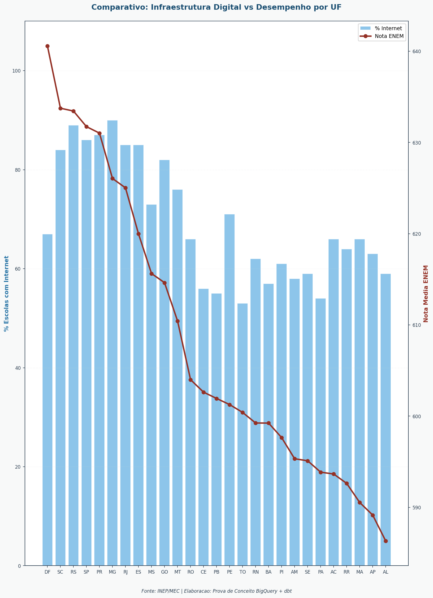
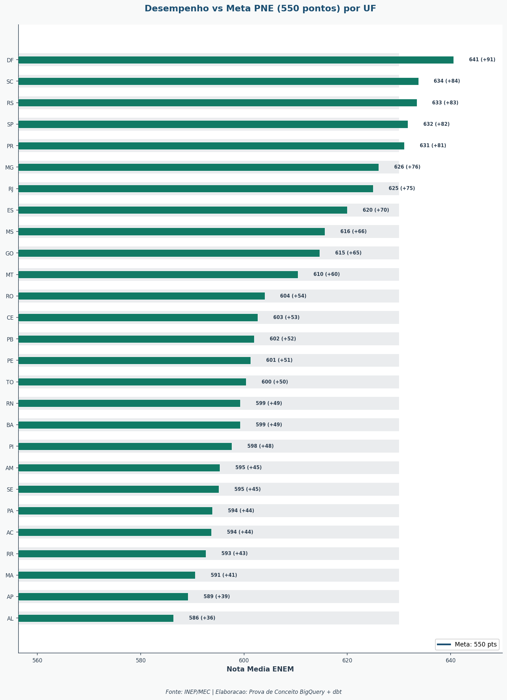
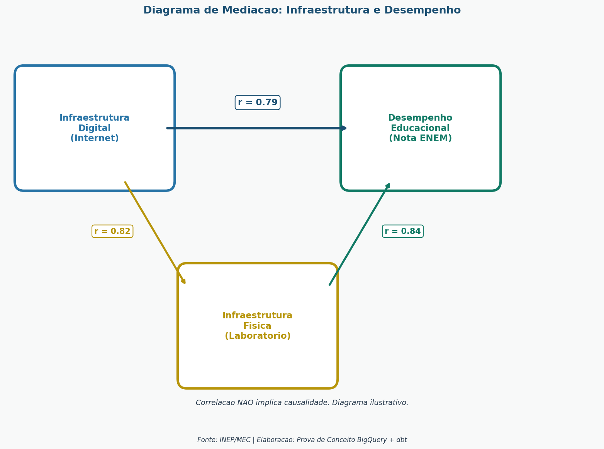

# Página 2: Análise Preditiva

## Título
**"Fatores de Sucesso: O Que Influencia o Desempenho Educacional?"**

## Objetivo
Identificar correlações entre variáveis de infraestrutura e desempenho educacional, permitindo entender quais fatores mais impactam os resultados.

> **Safra dos dados:** Censo Escolar e microdados ENEM — referência 2023 (publicação INEP 2024).

---

## Metodologia Aplicada

### Regressão Linear (regressao_educacao.py)
Modelo: `Nota ENEM = B0 + B1 x % Escolas com Internet + e`

### Correlação de Pearson (analise_correlacao_causalidade.py)
Mede a força da relação linear entre variáveis (-1 a +1)

---

## Gráficos

### 1. Scatter Plot: % Internet vs Nota ENEM

Dispersão com linha de tendência mostrando a correlação entre infraestrutura digital e desempenho.

**Fonte:**
```
Censo Escolar da Educação Básica 2023 — INEP/MEC
Microdados do ENEM 2023 — INEP/MEC
```

**Título:**
```
Conectividade Escolar vs. Desempenho no ENEM — 2023
```

```sql
SELECT PCT_ESCOLAS_INTERNET, NOTA_MEDIA_ENEM, UF
FROM `provas-de-conceitos.mec_educacao_dev.mart_educacao_uf`
WHERE ANO = 2023
```

**Rótulos sugeridos:**

| Elemento | Rótulo exibido |
|----------|----------------|
| Eixo X | % Escolas Conectadas à Internet |
| Eixo Y | Desempenho Médio ENEM (0–1000) |
| Rótulos de ponto | UF |
| Cor dos pontos | `#2874A6` |

**Narrativa:** A dispersão evidencia uma correlação positiva clara: estados com maior percentual de escolas conectadas tendem a apresentar notas ENEM mais altas. A linha de tendência ascendente confirma que infraestrutura digital é um preditor relevante de desempenho. Estados como AP e MA — baixo índice de conectividade e notas abaixo da média — são os candidatos naturais a programas de expansão de acesso digital.


---

### 2. Heatmap: Matriz de Correlação

Mapa de calor identificando quais variáveis têm maior correlação com o desempenho.

**Fonte:**
```
Censo Escolar da Educação Básica 2023 — INEP/MEC
Microdados do ENEM 2023 — INEP/MEC
```

**Título:**
```
Matriz de Correlação entre Indicadores Educacionais
```

```sql
SELECT * FROM `provas-de-conceitos.mec_educacao_dev.mart_correlacoes`
```

**Rótulos sugeridos:**

| Elemento | Rótulo exibido |
|----------|----------------|
| Dimensão linha | Variável A |
| Dimensão coluna | Variável B |
| Métrica | Correlação de Pearson |

Escala de cor do heatmap:

| Valor | Cor (hex) | Significado |
|-------|-----------|-------------|
| -1.0 | `#943126` | Correlação negativa forte |
| 0.0 | `#F8F9F9` | Sem correlação |
| +1.0 | `#1B4F72` | Correlação positiva forte |

**Narrativa:** O heatmap revela quais variáveis se movem juntas. Correlações acima de 0.6 (células em azul escuro) indicam relações robustas que merecem atenção em políticas públicas. Se PCT_ESCOLAS_INTERNET e NOTA_MEDIA_ENEM aparecem em azul escuro, isso reforça o argumento de que conectividade não é apenas infraestrutura — é fator educacional direto.


---

### 3. Gráfico Combo: Infraestrutura Digital vs Desempenho por UF

Barras (% internet) + linha (nota ENEM) para comparar simultaneamente infraestrutura e desempenho.

**Fonte:**
```
Censo Escolar da Educação Básica 2023 — INEP/MEC
Microdados do ENEM 2023 — INEP/MEC
```

**Título:**
```
Conectividade e Desempenho por Estado — 2023
```

```sql
SELECT UF, PCT_ESCOLAS_INTERNET, NOTA_MEDIA_ENEM
FROM `provas-de-conceitos.mec_educacao_dev.mart_educacao_uf`
WHERE ANO = 2023
ORDER BY NOTA_MEDIA_ENEM DESC
```

**Rótulos sugeridos:**

| Elemento | Rótulo exibido |
|----------|----------------|
| Dimensão | Estado (UF) |
| Métrica barra | % Escolas Conectadas |
| Métrica linha | Desempenho Médio ENEM (0–1000) |

| Série | Cor (hex) |
|-------|-----------|
| Barras — % Internet | `#2874A6` |
| Linha — Nota ENEM | `#943126` |

**Narrativa:** O gráfico combo permite identificar anomalias: estados onde a linha de nota não acompanha a altura das barras de conectividade podem indicar outros fatores limitantes (pobreza, distância de centros urbanos, qualidade docente). Estados onde ambas as métricas estão baixas são candidatos a intervenção prioritária integrada.



---

### 4. Bullet Chart: Desempenho vs Meta PNE

Cada UF comparada à meta de 550 pontos do PNE, com gap positivo ou negativo.

**Fonte:**
```
Microdados do ENEM 2023 — INEP/MEC
```

**Título:**
```
Gap em Relação à Meta PNE por Estado — 2023
```

```sql
SELECT UF, NOTA_MEDIA_ENEM, 550 AS META_NOTA
FROM `provas-de-conceitos.mec_educacao_dev.mart_educacao_uf`
WHERE ANO = 2023
```

**Rótulos sugeridos:**

| Elemento | Rótulo exibido |
|----------|----------------|
| Dimensão | Estado (UF) |
| Métrica realizada | Desempenho Médio ENEM (0–1000) |
| Linha de meta | Meta PNE: 550 pontos |

| Status | Cor (hex) | Critério |
|--------|-----------|----------|
| Acima da meta | `#1B4F72` | Nota >= 550 |
| Abaixo da meta | `#943126` | Nota < 550 |

**Narrativa:** A maioria dos estados brasileiros ainda está abaixo da meta de 550 pontos estabelecida pelo Plano Nacional de Educação. O gap médio representa anos de aprendizado não consolidado. Estados com gaps superiores a 50 pontos exigem intervenção sistêmica — não apenas reforço escolar pontual, mas revisão completa de currículo, formação de professores e infraestrutura.



---

### 5. Diagrama de Mediação

Visualização das relações entre infraestrutura digital, infraestrutura física e desempenho educacional com coeficientes de correlação.

**Fonte:**
```
Censo Escolar da Educação Básica 2023 — INEP/MEC
Microdados do ENEM 2023 — INEP/MEC
```

**Título:**
```
Relações entre Infraestrutura e Desempenho Educacional
```

**Rótulos sugeridos:**

| Elemento | Rótulo exibido |
|----------|----------------|
| Nó central | Desempenho ENEM |
| Nós periféricos | % Escolas Conectadas / % Escolas com Laboratório |
| Arestas | Coeficiente de Correlação de Pearson |

**Narrativa:** O diagrama de mediação revela se a infraestrutura digital age diretamente sobre o desempenho ou se é mediada por outros fatores (como infraestrutura física). Coeficientes de correlação nas arestas acima de 0.5 sugerem relações suficientemente fortes para embasar decisões de alocação de recursos.



---

### 6. Tabela: Descrição dos Clusters

Resumo dos clusters identificados com quantidade de UFs, média ENEM e percentual de internet.

**Fonte:**
```
Censo Escolar da Educação Básica 2023 — INEP/MEC
Microdados do ENEM 2023 — INEP/MEC
```

**Título:**
```
Perfil dos Clusters Educacionais por Estado — 2023
```

**Rótulos sugeridos das colunas:**

| Campo | Rótulo exibido |
|-------|----------------|
| `CLUSTER_ID` | Cluster |
| `DESCRICAO_CLUSTER` | Perfil do Grupo |
| `COUNT(UF)` | Nº de Estados |
| `AVG(NOTA_MEDIA_ENEM)` | Média ENEM (0–1000) |
| `PRIORIDADE_INVESTIMENTO` | Prioridade |

Formatação condicional em `PRIORIDADE_INVESTIMENTO`:

| Valor | Cor (hex) |
|-------|-----------|
| ALTA | `#943126` |
| MEDIA | `#B7950B` |
| BAIXA | `#117A65` |
| MONITORAMENTO | `#2874A6` |

**Narrativa:** A tabela de clusters traduz o modelo matemático em linguagem de gestão. O cluster com prioridade ALTA concentra os estados que mais precisam de atenção imediata — são os mesmos que aparecem em vermelho no mapa de clusters. Use esta tabela para definir critérios de elegibilidade em editais de programas federais de conectividade e infraestrutura escolar.


---

## Narrativa Geral da Página

> **"A análise de regressão revela que o percentual de escolas com internet é um fator fortemente associado ao desempenho no ENEM. Estados com maior conectividade, como DF, SP e SC, apresentam notas consistentemente acima da média nacional."**

> **"A infraestrutura digital atua como variável-chave: investimentos em conectividade escolar estão diretamente associados a melhores resultados educacionais. Isso sugere que políticas de universalização do acesso à internet nas escolas podem ajudar a reduzir desigualdades."**

---

## Cuidados na Interpretação

**IMPORTANTE:** Correlação NÃO implica causalidade!

- A relação internet x nota pode ter confundidores
- Dados transversais limitam inferências causais
- Sempre considere explicações alternativas

---

## Perguntas que Esta Página Responde

1. Qual a relação entre infraestrutura digital e desempenho no ENEM?
2. Quais variáveis mais influenciam as notas?
3. O acesso à internet impacta o desempenho?
4. Quais estados estão abaixo da meta de desempenho?
5. Quais grupos de UFs compartilham perfis educacionais semelhantes?

---

## Tabela de Dados (BigQuery)

**Tabela:** `mart_correlacoes`

| Coluna | Descrição |
|--------|-----------|
| VARIAVEL_1 | Primeira variável |
| VARIAVEL_2 | Segunda variável |
| CORRELACAO_PEARSON | Coeficiente de correlação |
| P_VALUE | Significância estatística |
| N_OBSERVACOES | Tamanho da amostra |
