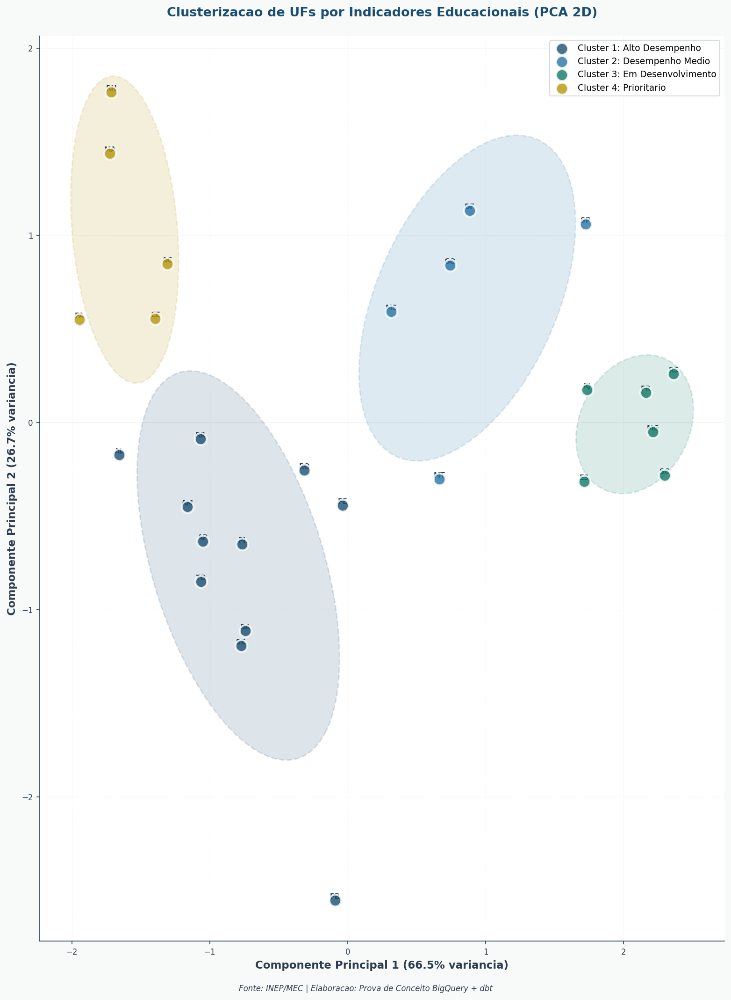
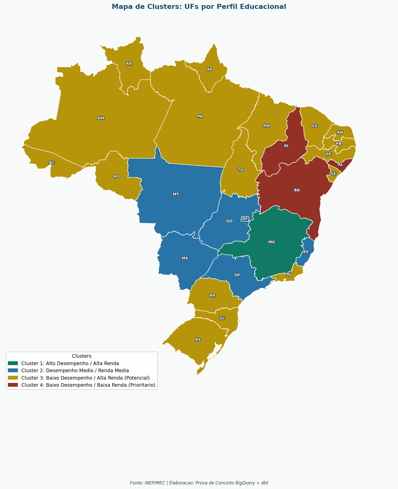
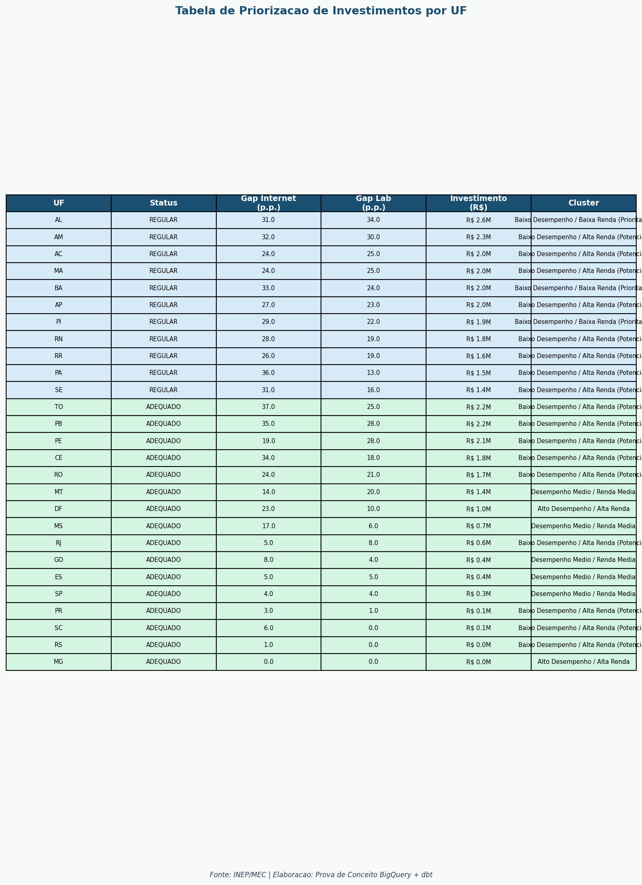
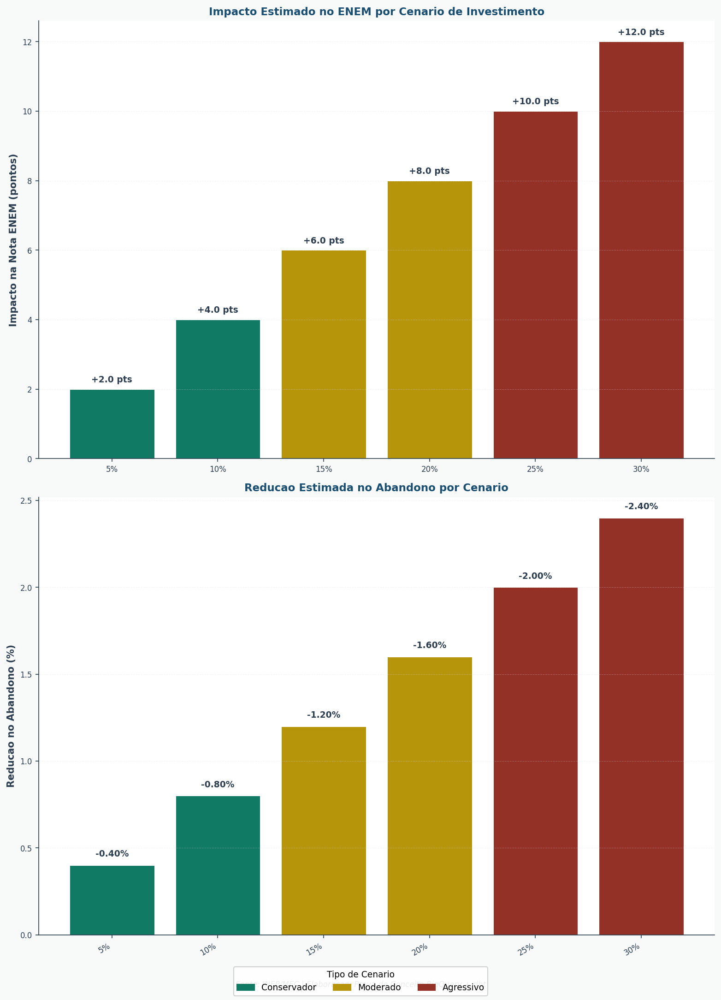
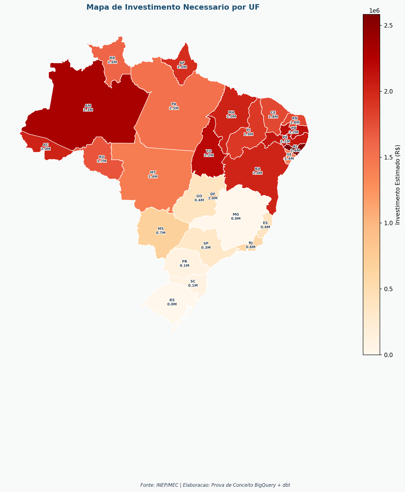
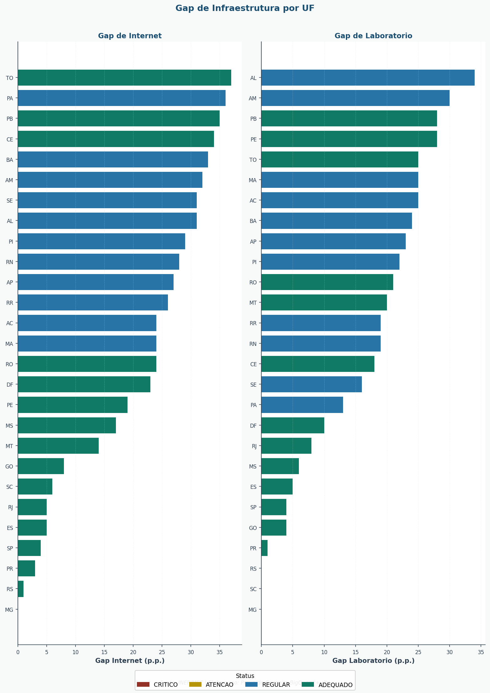

# Pagina 3: Analise Prescritiva

## Titulo
**"Onde Investir? Priorizacao Inteligente de Recursos Educacionais"**

## Objetivo
Fornecer recomendacoes acionaveis sobre onde e como investir recursos para maximizar o impacto na educacao, utilizando clusterizacao e simulacao de cenarios.

---

## Metodologia Aplicada

### Clusterizacao K-Means (analise_clusterizacao.py)
Agrupa UFs com caracteristicas educacionais similares para direcionar politicas especificas.

**Variaveis utilizadas:**
- Nota Media ENEM
- % Escolas com Internet
- % Escolas com Laboratorio
- Alunos por Docente

### Simulacao de Investimentos (analise_impacto_financeiro.py)
Estima o impacto de diferentes niveis de aumento orcamentario nos indicadores.

---

## Graficos

### 1. Scatter 2D: Clusters de UFs

Dispersao com PCA mostrando os agrupamentos naturais de estados por perfil educacional.

**Fonte BigQuery:** `provas-de-conceitos.mec_educacao_dev.mart_clusters`

```sql
SELECT UF, PC1, PC2, CLUSTER_ID, DESCRICAO_CLUSTER
FROM `provas-de-conceitos.mec_educacao_dev.mart_clusters`
```



---

### 2. Mapa de Clusters por UF

Visualizacao geografica dos clusters educacionais no territorio brasileiro.

**Fonte BigQuery:** `provas-de-conceitos.mec_educacao_dev.mart_clusters`



---

### 3. Priorizacao de Investimentos por UF

Investimento total estimado por estado, colorido por status de desempenho.

**Fonte BigQuery:** `provas-de-conceitos.mec_educacao_dev.mart_alocacao`

```sql
SELECT UF, INVESTIMENTO_TOTAL_ESTIMADO_BRL, STATUS_DESEMPENHO
FROM `provas-de-conceitos.mec_educacao_dev.mart_alocacao`
ORDER BY INVESTIMENTO_TOTAL_ESTIMADO_BRL DESC
```


---

### 4. Tabela de Priorizacao

Ranking de estados por necessidade de investimento com status, gaps de infraestrutura e valores estimados.

**Fonte BigQuery:** `provas-de-conceitos.mec_educacao_dev.mart_alocacao`, `provas-de-conceitos.mec_educacao_dev.mart_clusters`

```sql
SELECT
    a.UF,
    a.STATUS_DESEMPENHO,
    a.GAP_INTERNET_PCT,
    a.GAP_LABORATORIO_PCT,
    a.INVESTIMENTO_TOTAL_ESTIMADO_BRL,
    c.DESCRICAO_CLUSTER
FROM `provas-de-conceitos.mec_educacao_dev.mart_alocacao` a
JOIN `provas-de-conceitos.mec_educacao_dev.mart_clusters` c ON a.UF = c.UF
ORDER BY a.ORDEM_PRIORIDADE
```



---

### 5. Simulacao de Cenarios de Investimento

Impacto estimado de diferentes niveis de aumento orcamentario na nota ENEM e na reducao do abandono escolar.

**Fonte BigQuery:** `provas-de-conceitos.mec_educacao_dev.mart_simulacao_cenarios`

```sql
SELECT CENARIO_NOME, AUMENTO_PERCENTUAL, IMPACTO_NOTA_ENEM_PONTOS,
       REDUCAO_ABANDONO_PCT, AVALIACAO_RISCO
FROM `provas-de-conceitos.mec_educacao_dev.mart_simulacao_cenarios`
```



---

### 6. Mapa de Investimento Necessario por UF

Visualizacao geografica do investimento estimado por estado.

**Fonte BigQuery:** `provas-de-conceitos.mec_educacao_dev.mart_alocacao`



---

### 7. Gap de Infraestrutura por UF

Comparativo dos gaps de internet e laboratorio por estado, com classificacao por status.

**Fonte BigQuery:** `provas-de-conceitos.mec_educacao_dev.mart_alocacao`

```sql
SELECT UF, GAP_INTERNET_PCT, GAP_LABORATORIO_PCT, STATUS_DESEMPENHO
FROM `provas-de-conceitos.mec_educacao_dev.mart_alocacao`
ORDER BY ORDEM_PRIORIDADE
```



---

## Narrativa

> **"A analise de clusterizacao identificou grupos distintos de estados. O cluster de intervencao prioritaria concentra estados majoritariamente no Norte e Nordeste, que apresentam indicadores significativamente abaixo da media nacional."**

> **"Simulacoes indicam que aumentos no orcamento educacional podem elevar a nota media do ENEM e reduzir a taxa de abandono. O retorno sobre investimento e mais alto nos estados do cluster prioritario, onde cada real investido gera maior impacto relativo."**

> **"Recomenda-se priorizar investimentos nos estados que apresentam os maiores gaps de infraestrutura e pertencem ao cluster de intervencao prioritaria."**

---

## Perguntas que Esta Pagina Responde

1. Quais estados tem caracteristicas educacionais similares?
2. Onde o investimento tera maior impacto?
3. Quanto precisamos investir para atingir a meta?
4. Quais estados estao com maiores gaps de infraestrutura?
5. Qual o impacto esperado para cada cenario de investimento?

---

## Acoes Recomendadas

| Cluster | Acao Prioritaria | Investimento Sugerido |
|---------|------------------|----------------------|
| Alto Desempenho | Programas de excelencia | Manutencao |
| Medio | Reforco escolar | +5% |
| Potencial | Infraestrutura tecnologica | +10% |
| Prioritario | **Intervencao integral** | **+20%** |

---

## Tabelas de Dados (BigQuery)

**Fonte 1:** `mart_clusters`

| Coluna | Descricao |
|--------|-----------|
| UF | Sigla do estado |
| CLUSTER_ID | Identificador do cluster (1-4) |
| DESCRICAO_CLUSTER | Nome descritivo |
| PC1, PC2 | Componentes principais (PCA) |

**Fonte 2:** `mart_alocacao`

| Coluna | Descricao |
|--------|-----------|
| UF | Sigla do estado |
| ANO | Ano de referencia |
| TOTAL_MATRICULAS | Total de matriculas |
| GAP_INTERNET_PCT | Gap de internet em pontos percentuais |
| GAP_LABORATORIO_PCT | Gap de laboratorio em pontos percentuais |
| STATUS_DESEMPENHO | Classificacao (Critico, Atencao, Regular, Adequado) |
| INVESTIMENTO_TOTAL_ESTIMADO_BRL | Investimento total estimado em reais |
| ORDEM_PRIORIDADE | Ranking de prioridade |

**Fonte 3:** `mart_simulacao_cenarios`

| Coluna | Descricao |
|--------|-----------|
| CENARIO_NOME | Nome do cenario |
| AUMENTO_PERCENTUAL | Percentual de aumento |
| IMPACTO_NOTA_ENEM_PONTOS | Impacto estimado na nota |
| REDUCAO_ABANDONO_PCT | Reducao estimada no abandono |
| AVALIACAO_RISCO | Nivel de risco |
